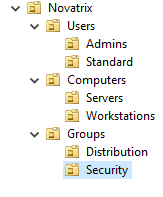
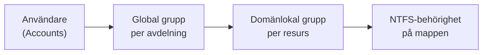
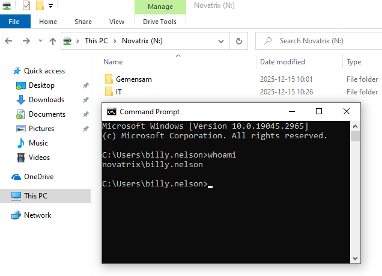
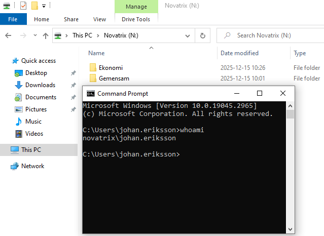
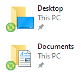
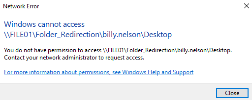
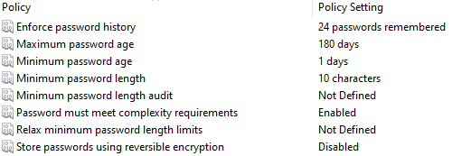
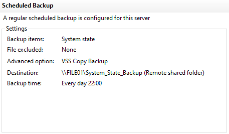
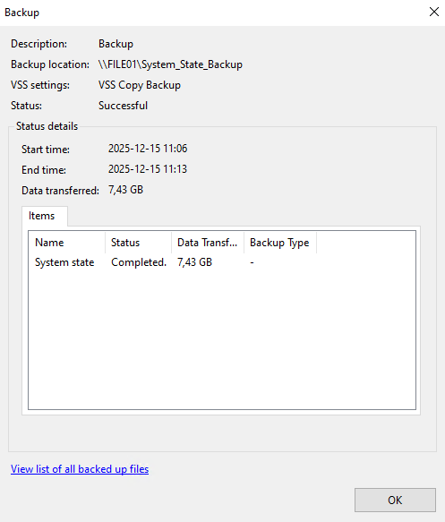
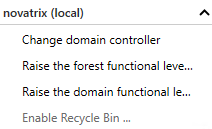

# Novatrix Secure Directory Initiative – säker Active Directory-miljö

En Active Directory-miljö byggd med säkerhet och återställning i fokus. Projektet täcker OU-design, behörigheter enligt AGDLP, filserver med Access-Based Enumeration, Group Policy för användare och klienter, skärpt lösenordspolicy, backup av AD och återställning av raderade objekt.

> Projekt inom utbildningen Moln- och virtualiseringsspecialist, Campus Mölndal.

**Teknik:** Windows Server · Active Directory · Group Policy · NTFS · Access-Based Enumeration · Folder Redirection · Windows Server Backup · AD Recycle Bin

---

## Miljö

| Server | Roll |
|---|---|
| AD01 | Domänkontrollant och DNS för domänen **novatrix.se** |
| FILE01 | Filserver för delade mappar, omdirigerade användarmappar och AD-backup |
| Klient | Domänansluten Windows 10-dator för tester |

## OU-struktur

| OU | Innehåll |
|---|---|
| Users/Admins | Administratörskonton, separerade från vanliga användare |
| Users/Standard | Vanliga användare, här länkas användarpolicyer |
| Computers/Servers | Servrar |
| Computers/Workstations | Klientdatorer, här länkas klientpolicyer |
| Groups/Distribution | Distributionsgrupper |
| Groups/Security | Säkerhetsgrupper för behörigheter |

Strukturen gör det tydligt var varje GPO hamnar. Användarpolicyer länkas till Standard och klientpolicyer till Workstations, så att en policy inte råkar träffa servrar eller administratörer.

## Behörigheter enligt AGDLP

Användare får aldrig behörighet direkt på en mapp. Åtkomst styrs via grupper:

Det gör behörigheterna spårbara och lätta att revidera, och en ny medarbetare får rätt åtkomst genom att läggas i en enda grupp.

## Filserver och Access-Based Enumeration

Den delade mappen på FILE01 mappas automatiskt som enhet **N:** för alla användare. Med **Access-Based Enumeration** ser användare bara de mappar de har behörighet till. Mappar utan behörighet syns inte ens.

| Mapp | Synlig för |
|---|---|
| Gemensam | Alla användare |
| IT | IT-avdelningen |
| Ekonomi | Ekonomiavdelningen |

ABE testades med två användare, och `whoami` visar vilket konto som är inloggat:

  
  

*Till vänster ser billy.nelson Gemensam och IT. Till höger ser johan.eriksson Ekonomi och Gemensam.*

## Group Policy

| GPO | Länkad till | Innehåll |
|---|---|---|
| **Drive_Maps** | Users/Standard | Mappar enhet N: till den delade mappen på FILE01 |
| **Folder_Redirection** | Users/Standard | Omdirigerar Skrivbord och Dokument till FILE01 |
| **Workstation_Security_Baseline** | Computers/Workstations | Säkerhetsbaslinje för klienter, se nedan |
| **Default Domain Policy** | novatrix.se | Lösenordspolicy för hela domänen |

### Säkerhetsbaslinje för klienter
- Datorn låses efter 240 sekunders inaktivitet
- Brandväggen är påslagen i domänprofilen
- Windows Defender-brandväggen skyddar alla nätverksanslutningar
- Smart namnuppslagning över flera nätverkskort är avstängd, så att DNS-frågor inte skickas ut på alla nätverk samtidigt

### Folder Redirection
Användarnas **Skrivbord** och **Dokument** sparas på filservern i stället för lokalt, i en egen mapp per användare. Det gör att data lagras centralt och kan säkerhetskopieras.

- Användaren får exklusiva rättigheter till sin egen mapp
- Befintligt innehåll flyttas automatiskt till servern
- Innehållet ligger kvar om policyn tas bort

  

*Skrivbord och Dokument visas med synkroniseringsikonen, vilket betyder att de är omdirigerade.*

*Den som saknar behörighet nekas åtkomst till en annan användares omdirigerade skrivbord.*

### GPO-rapport
Alla GPO:er är exporterade i [`gpo-rapport/gpo-rapport.html`](gpo-rapport/gpo-rapport.html), med scope, länkar och exakta värden. GitHub visar HTML-filer som kod, så ladda ner filen och öppna den i en webbläsare för att se rapporten.

## Lösenordspolicy

| Inställning | Värde | Syfte |
|---|---|---|
| Minsta längd | 10 tecken | Gör lösenord svårare att knäcka vid stöld eller offline-attacker |
| Komplexitetskrav | På | Gör lösenord svårare att gissa och knäcka |
| Lösenordshistorik | 24 lösenord | Hindrar att gamla lösenord återanvänds |
| Minsta ålder | 1 dag | Hindrar att man byter flera gånger i rad för att komma tillbaka till ett gammalt lösenord |
| Högsta ålder | 180 dagar | Begränsar hur länge ett stulet lösenord går att använda |
| Reversibel kryptering | Av | Lösenord lagras aldrig i en form som går att dekryptera |

Domänpolicyn ser också till att LAN Manager-hashar inte sparas och att anonym översättning mellan SID och namn är avstängd.

## Backup av Active Directory

En schemalagd **System State-backup** körs varje dag klockan 22:00 och sparas på filservern.

  
  

*Till vänster schemat, till höger en lyckad körning på 7,43 GB.*

Status kontrolleras i Windows Server Backup och vid behov i Event Viewer. Vid en incident återställs AD med **System State Restore** från backupen på FILE01, vilket återställer AD-databasen och tillhörande komponenter.

## AD Recycle Bin

**AD Recycle Bin** är aktiverad i domänen. Då kan raderade objekt återställas snabbt, utan att hela AD behöver återställas från backup.

*Alternativet Enable Recycle Bin är gråmarkerat, eftersom funktionen redan är aktiverad.*

**Test:** en testanvändare raderades och återställdes sedan via AD Recycle Bin. Användaren blev synlig och användbar igen i AD.

## Säkerhetsbedömning

| Hot | Motåtgärd i miljön |
|---|---|
| Stöld av inloggningsuppgifter och offline-knäckning av lösenord | Skärpt lösenordspolicy, och LM-hashar sparas inte |
| Pass-the-hash och Kerberoasting | Starka lösenord försvårar knäckning av tjänstekonton, och separata administratörskonton begränsar vad en stulen hash kan användas till |
| Felaktigt GPO-scope som sänker säkerheten brett | Separata OU:er: användarpolicyer på Standard och klientpolicyer på Workstations |
| Rättighetsläckage via fel grupper eller NTFS | AGDLP, NTFS-behörigheter och ABE |
| Misstag och incidenter | System State-backup och AD Recycle Bin |

## Möjliga förbättringar

- Aktivera **kontolåsning**. Enligt GPO-rapporten är tröskeln 0, vilket betyder att ett konto aldrig låses efter felaktiga inloggningsförsök. En tröskel skulle försvåra lösenordsgissning.

## Vad jag lärde mig

Projektet lärde mig att säkerhet i AD börjar med struktur. När användare, datorer och grupper ligger i egna OU:er blir det tydligt var varje GPO hamnar, och risken minskar att en policy träffar fel objekt.

ABE var ett bra exempel på hur en liten inställning gör stor skillnad för användaren. Med rätt NTFS-behörigheter ser varje person bara de mappar som hör till deras roll, och att testa med två olika användare och `whoami` gjorde det lätt att visa att det fungerade.

Jag lärde mig också skillnaden mellan två sorters återställning. AD Recycle Bin räcker för att snabbt få tillbaka ett raderat objekt, medan System State-backup behövs om hela domänkontrollanten måste återställas.
